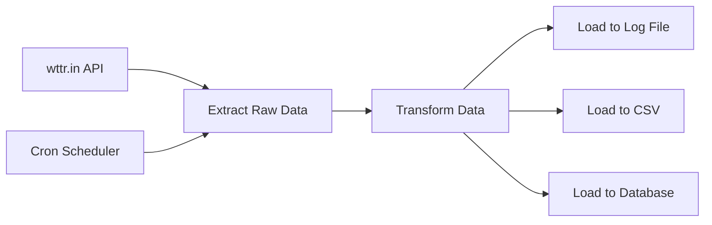

# 🌤️ Weather ETL Pipeline for Casablanca, Morocco

A comprehensive ETL (Extract, Transform, Load) pipeline that automatically collects weather data for Casablanca, Morocco every day at noon.

## 📋 Overview

This project extracts current temperature and tomorrow's noon forecast from the wttr.in weather API, transforms the data into a standardized format, and loads it into multiple storage formats for analysis and tracking.

## 🎯 Requirements Fulfilled

✅ **Download raw weather data** - Extracts from wttr.in JSON API  
✅ **Extract data of interest** - Current temperature and tomorrow's forecast  
✅ **Transform data as required** - Converts to tabular format with year/month/day  
✅ **Load data into log file** - Tab-separated tabular format  
✅ **Schedule automatic daily execution** - Cron job setup at noon local time  

## 📊 Data Output Format

The pipeline generates weather data in the exact requested format:

```
year    month   day     obs_tmp fc_temp
2025    7       28      27      26
2025    7       29      28      25
2025    7       30      29      27
```

**Columns:**
- `year` - Current year (YYYY)
- `month` - Current month (1-12) 
- `day` - Current day (1-31)
- `obs_tmp` - Observed/current temperature in Celsius
- `fc_temp` - Forecasted temperature for tomorrow at noon in Celsius

## 🗂️ Project Files

```
weather_etl/
├── weather_etl.py          # Main ETL pipeline script
├── run_weather_etl.sh      # Shell wrapper for cron scheduling
├── setup_scheduler.md      # Detailed cron setup instructions
├── README.md              # This file
├── weather_data.log       # Weather data in tabular format
├── weather_data.csv       # Weather data in CSV format
├── weather_data.db        # SQLite database with weather data
├── weather_etl.log        # ETL pipeline execution logs
└── cron_runner.log        # Cron execution logs
```

## 🚀 Quick Start

### 1. Install Dependencies

```bash
# Using conda (recommended)
conda install requests pandas

# Or using pip
pip install requests pandas
```

### 2. Run the Pipeline

```bash
# Manual execution
python weather_etl.py

# Or using the shell wrapper
./run_weather_etl.sh
```

### 3. Set up Daily Automation

```bash
# Edit your crontab
crontab -e

# Add this line (replace with your actual path):
0 12 * * * /full/path/to/weather_etl/run_weather_etl.sh
```

For detailed scheduling instructions, see [setup_scheduler.md](setup_scheduler.md).

## 🏗️ Architecture

### ETL Pipeline Flow



### Data Sources
- **API**: [wttr.in](https://wttr.in) - Free weather service
- **Location**: Casablanca, Morocco
- **Format**: JSON API (`?format=j1`)

### Data Storage
- **Log File**: Tab-separated format for daily tracking
- **CSV File**: Standard CSV format for analysis
- **SQLite Database**: Structured storage with timestamps

## 📈 Features

### ✨ Core Functionality
- **Automated Data Collection**: Daily execution at noon
- **Multiple Storage Formats**: Log, CSV, and SQLite database
- **Error Handling**: Comprehensive logging and exception management
- **Data Validation**: Ensures data quality and consistency
- **Duplicate Prevention**: Uses date-based unique constraints

### 📋 Logging & Monitoring
- **Execution Logs**: Detailed pipeline execution tracking
- **Cron Logs**: Scheduling and automation monitoring  
- **Error Reporting**: Comprehensive error messages and stack traces
- **Data Display**: Recent weather data preview after each run

### 🔧 Configuration Options
- **City**: Easily configurable for different locations
- **Schedule**: Flexible cron scheduling options
- **Output Paths**: Customizable file locations
- **API Settings**: Configurable timeouts and headers

## 🧪 Testing

### Manual Testing

```bash
# Test the main script
python weather_etl.py

# Test the shell wrapper
./run_weather_etl.sh

# Check output files
cat weather_data.log
head weather_data.csv
```

### Automated Testing

```bash
# Test with temporary frequent scheduling
# Add to crontab for testing:
* * * * * /path/to/weather_etl/run_weather_etl.sh

# Monitor logs in real-time
tail -f cron_runner.log
```

## 📚 Technical Details

### API Integration
- **Endpoint**: `https://wttr.in/casablanca?format=j1`
- **Method**: HTTP GET with JSON response
- **Timeout**: 10 seconds with error handling
- **Rate Limiting**: Respectful usage with User-Agent header

### Data Transformation
- **Current Temperature**: Extracted from `current_condition[0]['temp_C']`
- **Forecast Temperature**: Extracted from tomorrow's noon forecast (`time: "1200"`)
- **Date Handling**: Uses system date for consistent tracking
- **Type Conversion**: String to integer conversion with validation

### Storage Implementation
- **Unique Constraints**: Prevents duplicate entries for same date
- **Atomic Operations**: Database transactions ensure data consistency
- **Append Mode**: Log and CSV files grow incrementally
- **Backup Strategy**: Multiple storage formats provide redundancy

## 🔧 Troubleshooting

### Common Issues

**Pipeline Fails to Run**
```bash
# Check Python installation
python --version

# Check dependencies
pip list | grep -E "(requests|pandas)"

# Check file permissions
ls -la run_weather_etl.sh
```

**Cron Job Not Executing**
```bash
# Check cron status (Linux)
systemctl status cron

# Check cron logs
grep CRON /var/log/syslog

# Verify crontab entry
crontab -l
```

**API Connection Issues**
```bash
# Test API manually
curl "wttr.in/casablanca?format=j1"

# Check internet connectivity
ping wttr.in
```

**Data Not Appearing**
```bash
# Check execution logs
tail -20 weather_etl.log

# Check cron execution logs  
tail -20 cron_runner.log

# Verify file permissions
ls -la weather_data.*
```

## 🎛️ Configuration

### Environment Variables

The pipeline can be configured using these environment variables:

```bash
export WEATHER_CITY="casablanca"          # Target city
export WEATHER_LOG_FILE="weather_data.log" # Log file path
export WEATHER_API_TIMEOUT="10"           # API timeout (seconds)
```

### Custom Locations

To monitor different cities, modify the configuration in `weather_etl.py`:

```python
CITY = "london"  # or "paris", "tokyo", etc.
```

## 📊 Sample Output

```
🌤️  WEATHER ETL RESULTS
Date: 2025-07-28
Current Temperature: 27°C
Tomorrow's Forecast (noon): 26°C

======================================================================
RECENT WEATHER DATA FOR CASABLANCA (Last 5 records)
======================================================================
Year   Month  Day  Obs°C  Fcst°C  Timestamp           
----------------------------------------------------------------------
2025   7      28   27     26      2025-07-28          
======================================================================
```

## 🤝 Contributing

1. Fork the repository
2. Create a feature branch (`git checkout -b feature/amazing-feature`)
3. Commit your changes (`git commit -m 'Add amazing feature'`)
4. Push to the branch (`git push origin feature/amazing-feature`)
5. Open a Pull Request

## 📄 License

This project is part of the IBM Data Engineer Professional Certificate coursework.

## 🙋‍♂️ Support

For issues or questions:
1. Check the [setup_scheduler.md](setup_scheduler.md) for detailed instructions
2. Review the troubleshooting section above
3. Check log files for error messages
4. Test the wttr.in API manually 